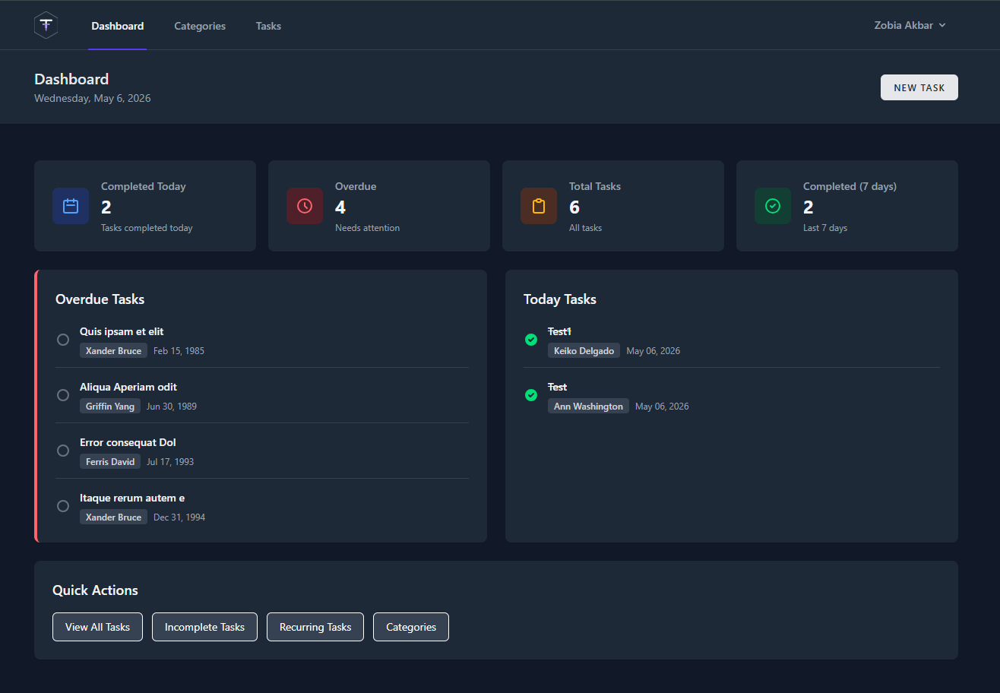
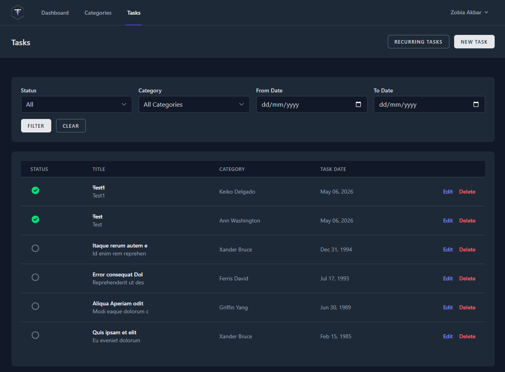
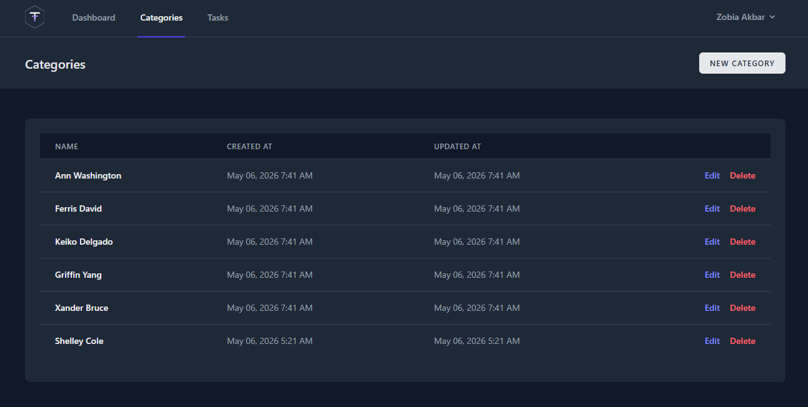
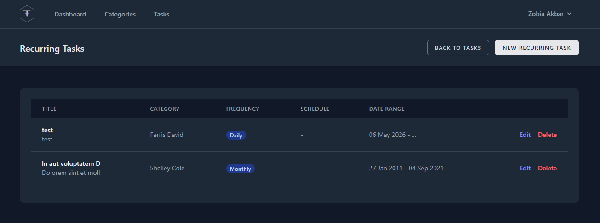
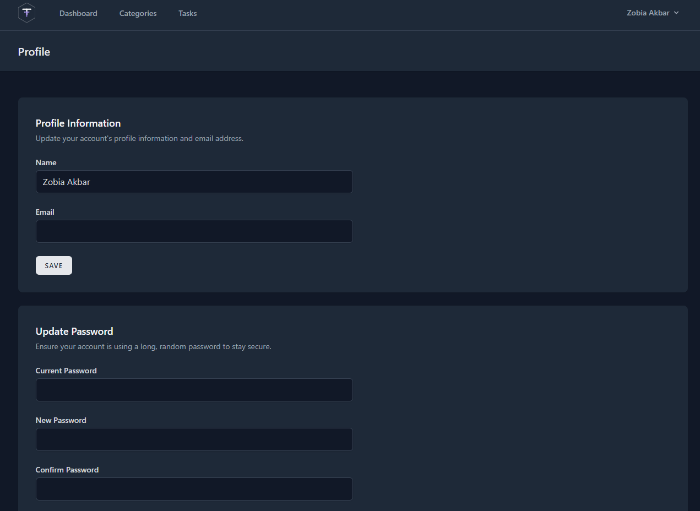

# TaskTracker

A full-stack task management application built with Laravel, Tailwind CSS, and PostgreSQL.

## Features

- **Authentication** — Register, login, email verification, password reset
- **Tasks** — Create, edit, delete tasks with status tracking and filters
- **Categories** — Organize tasks by custom categories
- **Recurring Tasks** — Schedule daily, weekly, monthly recurring tasks
- **Dashboard** — Overview of today's tasks, overdue tasks, and stats
- **Profile Management** — Update profile info, change password, delete account
- **Dark Mode** — Full dark theme UI

## Tech Stack

- **Backend:** PHP, Laravel
- **Frontend:** Blade, Tailwind CSS, Vite
- **Database:** PostgreSQL (Neon)
- **Auth:** Laravel built-in authentication with email verification

## Screenshots

### Dashboard


### Tasks


### Categories


### Recurring Tasks


### Profile


## Local Setup

```bash
git clone https://github.com/zobdhillon/TaskTracker.git
cd TaskTracker
composer install
npm install
cp .env.example .env
php artisan key:generate
php artisan migrate
npm run dev
php artisan serve
```

## License
MIT
